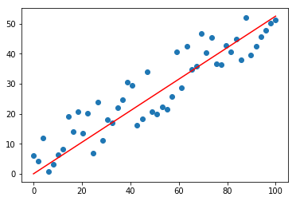
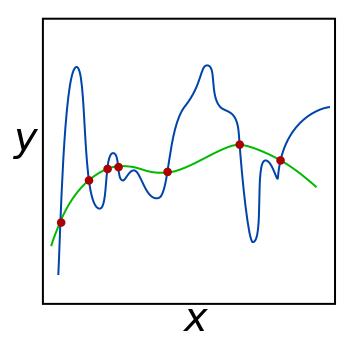

# Linear Regression

## What is Linear Regression?

In statistics, linear regression is a linear approach to modelling the relationship between a dependent variable(y) and one or more independent variables(X). In linear regression, the relationships are modeled using linear predictor functions whose unknown model parameters are estimated  from the data. Linear Regression is one of the most popular algorithms in Machine Learning. That’s due to its relative simplicity and well known properties.

## Simple Linear Regression

Linear Regression is called simple if you are only working with one independent variable.

Formula: $f(x)=mx+b$

### Cost Function

We can measure the accuracy of our linear regression algorithm using the **mean squared error** (mse) cost function. MSE measures the average squared distance between the predicted output and the actual output (label).

$$Error(m, b)=\frac{1}{N}\sum_{i=1}^{N}(actual\:output - predicted\:output)^{2}$$

### Optimiztation

To find the coefficients that minimize our error function we will use gradient descent. Gradient descent is a optimization algorithm which iteratively takes steps to the local minimum of the cost function.

To find the way towards the minimum we take the derivative of the error function in respect to our slope m and our y intercept b. Then we take a step in the negative direction of the derivative.

General Gradient Descent Formula:

$$\theta_j:=\theta_j-\alpha\frac{\partial}{\partial\theta_j}J(\theta_0, \theta_1)$$

Gradient Descent Formulas for simple linear regression:

$$\frac{\partial}{\partial m}=\frac{2}{N} \sum_{i=1}^{N}-x_i(y_i-(mx_i+b))$$$$\frac{\partial}{\partial b}=\frac{2}{N} \sum_{i=1}^{N}-(y_i-(mx_i+b))$$

## Multivariate Linear Regression

Linear Regression is called multivariate if you are working with at least two independent variables. Each of the independent variables also called features gets multiplied with a weight which is learned by our linear regression algorithm.

$$Formula: f(x)=b+w_1x_1+w_2x_2+...+w_nx_n=b+\sum_{i=1}^{n}w_ix_i$$

Loss and optimizer are the same as for simple linear regression. The only difference is that the optimizer is now used for any weight (w_1 to w_i) instead of only for m and b.

## Regularization

Regularization are techniques used to reduce overfitting. This is really important to create models that generalize well on new data.

Mathematically speaking, it adds a regularization term in order to prevent the coefficients to fit so perfectly to overfit. For Linear Regression we can decide between two techniques – L1 and L2 Regularization.

For more information on the difference between L1 and L2 Regularization check out the following article:

* http://www.chioka.in/differences-between-l1-and-l2-as-loss-function-and-regularization/

You can add regularization to Linear Regression by adding regularization term to either the loss function or to the weight update.

L1 regularization:

$$J(\theta)=\frac{1}{2m}\left[\sum_{i=1}^{m}\left(h_{\theta}(x^{(i)})-y^{(i)}\right)^2+\lambda\sum_{j=1}^{n}\left|\theta_j\right|\right]$$

L2 regularization:

$$J(\theta)=\frac{1}{2m}\left[\sum_{i=1}^{m}\left(h_{\theta}(x^{(i)})-y^{(i)}\right)^2+\lambda\sum_{j=1}^{n}\theta_j^2\right]$$

## Code

* [Simple Linear Regression](code/simple_linear_regression.py)
* [Multivariate Linear Regression](code/multivariate_linear_regression.py)
* [Linear Regression Explained](code/linear_regression_explained.ipynb)

## Credit / Other resources

* [Linear Regression (Wikipedia)](https://en.wikipedia.org/wiki/Linear_regression)
* [Simple and Multiple Linear Regression in Python (Adi Bronshtein on Medium)](https://towardsdatascience.com/simple-and-multiple-linear-regression-in-python-c928425168f9)
* [Linear Regression (Scikit Learn Documentation)](http://scikit-learn.org/stable/modules/generated/sklearn.linear_model.LinearRegression.html)